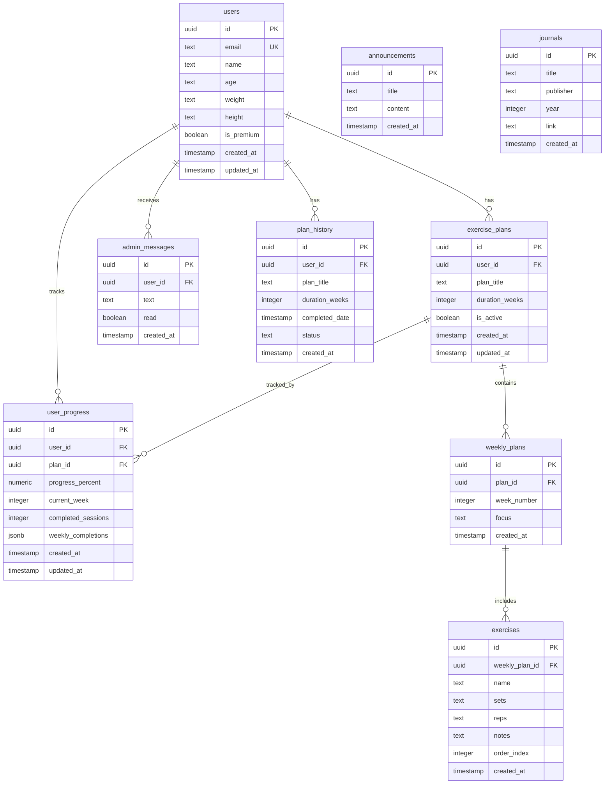

# PhsioApp - Database Documentation

Dokumentasi lengkap untuk database schema PhsioApp menggunakan Supabase PostgreSQL.

## Overview

PhsioApp menggunakan Supabase (PostgreSQL) untuk menyimpan data users, exercise plans, progress tracking, messages, announcements, dan journals. Database didesain dengan Row Level Security (RLS) untuk memastikan users hanya dapat mengakses data mereka sendiri.

## Database Architecture



## Tables

### users

Menyimpan informasi profil user.

| Column | Type | Description |
|--------|------|-------------|
| `id` | UUID | Primary key, auto-generated |
| `email` | TEXT | Email user (unique) |
| `name` | TEXT | Nama lengkap user |
| `age` | TEXT | Umur user |
| `weight` | TEXT | Berat badan (kg) |
| `height` | TEXT | Tinggi badan (cm) |
| `is_premium` | BOOLEAN | Status premium membership |
| `created_at` | TIMESTAMPTZ | Waktu pembuatan record |
| `updated_at` | TIMESTAMPTZ | Waktu update terakhir (auto-update) |

**Indexes:**
- `idx_users_email` on `email` - Untuk faster email lookups

**RLS Policies:**
- Users dapat view, update, dan insert profile mereka sendiri
- User ID harus match dengan `auth.uid()`

---

### exercise_plans

Menyimpan exercise plans yang di-assign ke users.

| Column | Type | Description |
|--------|------|-------------|
| `id` | UUID | Primary key |
| `user_id` | UUID | Foreign key ke users |
| `plan_title` | TEXT | Judul exercise plan |
| `duration_weeks` | INTEGER | Durasi plan dalam minggu |
| `is_active` | BOOLEAN | Apakah ini active plan user |
| `created_at` | TIMESTAMPTZ | Waktu pembuatan |
| `updated_at` | TIMESTAMPTZ | Waktu update terakhir |

**Indexes:**
- `idx_exercise_plans_user_id` on `user_id`
- `idx_exercise_plans_active` on `(user_id, is_active)`

**RLS Policies:**
- Users hanya dapat CRUD plans mereka sendiri

---

### weekly_plans

Detail plan per minggu dalam exercise plan.

| Column | Type | Description |
|--------|------|-------------|
| `id` | UUID | Primary key |
| `plan_id` | UUID | Foreign key ke exercise_plans |
| `week_number` | INTEGER | Nomor minggu (1-N) |
| `focus` | TEXT | Area fokus untuk minggu ini |
| `created_at` | TIMESTAMPTZ | Waktu pembuatan |

**Indexes:**
- `idx_weekly_plans_plan_id` on `plan_id`

**RLS Policies:**
- Users dapat CRUD weekly plans yang terkait dengan exercise plans mereka

---

### exercises

Individual exercises dalam weekly plan.

| Column | Type | Description |
|--------|------|-------------|
| `id` | UUID | Primary key |
| `weekly_plan_id` | UUID | Foreign key ke weekly_plans |
| `name` | TEXT | Nama exercise |
| `sets` | TEXT | Jumlah sets |
| `reps` | TEXT | Jumlah reps |
| `notes` | TEXT | Catatan tambahan |
| `order_index` | INTEGER | Urutan exercise |
| `created_at` | TIMESTAMPTZ | Waktu pembuatan |

**Indexes:**
- `idx_exercises_weekly_plan_id` on `weekly_plan_id`

**RLS Policies:**
- Users dapat CRUD exercises yang terkait dengan weekly plans mereka

---

### user_progress

Progress tracking untuk exercise plans.

| Column | Type | Description |
|--------|------|-------------|
| `id` | UUID | Primary key |
| `user_id` | UUID | Foreign key ke users |
| `plan_id` | UUID | Foreign key ke exercise_plans |
| `progress_percent` | NUMERIC(5,2) | Persentase completion (0-100) |
| `current_week` | INTEGER | Minggu saat ini |
| `completed_sessions` | INTEGER | Total sessions yang completed |
| `weekly_completions` | JSONB | Array of weekly completion counts |
| `created_at` | TIMESTAMPTZ | Waktu pembuatan |
| `updated_at` | TIMESTAMPTZ | Waktu update terakhir |

**Constraints:**
- `UNIQUE(user_id, plan_id)` - Satu progress per plan per user

**Indexes:**
- `idx_user_progress_user_id` on `user_id`
- `idx_user_progress_plan_id` on `plan_id`

**RLS Policies:**
- Users dapat view, create, dan update progress mereka sendiri

---

### admin_messages

Pesan dari admin ke users.

| Column | Type | Description |
|--------|------|-------------|
| `id` | UUID | Primary key |
| `user_id` | UUID | Foreign key ke users (recipient) |
| `text` | TEXT | Isi pesan |
| `read` | BOOLEAN | Status read/unread |
| `created_at` | TIMESTAMPTZ | Waktu pembuatan |

**Indexes:**
- `idx_admin_messages_user_id` on `user_id`
- `idx_admin_messages_unread` on `(user_id, read)`

**RLS Policies:**
- Users dapat view dan update (mark as read) messages mereka
- Admins dapat create messages (via service_role key)

---

### announcements

Pengumuman global dari admin.

| Column | Type | Description |
|--------|------|-------------|
| `id` | UUID | Primary key |
| `title` | TEXT | Judul announcement |
| `content` | TEXT | Isi announcement |
| `created_at` | TIMESTAMPTZ | Waktu pembuatan |

**Indexes:**
- `idx_announcements_created_at` on `created_at DESC`

**RLS Policies:**
- Semua authenticated users dapat view announcements
- Only admins dapat create/update/delete (via service_role key)

---

### journals

Daftar jurnal fisioterapi.

| Column | Type | Description |
|--------|------|-------------|
| `id` | UUID | Primary key |
| `title` | TEXT | Nama jurnal |
| `publisher` | TEXT | Nama publisher |
| `year` | INTEGER | Tahun mulai publikasi |
| `link` | TEXT | URL ke jurnal |
| `created_at` | TIMESTAMPTZ | Waktu pembuatan |

**Indexes:**
- `idx_journals_title` on `title`

**RLS Policies:**
- Semua authenticated users dapat view journals
- Only admins dapat create/delete journals

---

### plan_history

Riwayat exercise plans yang sudah completed/replaced.

| Column | Type | Description |
|--------|------|-------------|
| `id` | UUID | Primary key |
| `user_id` | UUID | Foreign key ke users |
| `plan_title` | TEXT | Judul plan |
| `duration_weeks` | INTEGER | Durasi plan |
| `completed_date` | TIMESTAMPTZ | Tanggal completion |
| `status` | TEXT | 'Completed' atau 'Replaced' |
| `created_at` | TIMESTAMPTZ | Waktu pembuatan |

**Constraints:**
- `CHECK (status IN ('Completed', 'Replaced'))`

**Indexes:**
- `idx_plan_history_user_id` on `user_id`
- `idx_plan_history_completed_date` on `(user_id, completed_date DESC)`

**RLS Policies:**
- Users dapat view dan create history mereka sendiri

## Helper Functions

### get_user_active_plan(p_user_id UUID)

Function untuk mendapatkan complete active plan dengan semua weekly plans dan exercises.

**Returns:** JSON object dengan structure:
```json
{
  "planTitle": "string",
  "durationWeeks": number,
  "weeklyPlans": [
    {
      "week": number,
      "focus": "string",
      "exercises": [
        {
          "name": "string",
          "sets": "string",
          "reps": "string",
          "notes": "string"
        }
      ]
    }
  ]
}
```

**Usage:**
```sql
SELECT get_user_active_plan('user-uuid-here');
```

## Security

### Row Level Security (RLS)

Semua tables menggunakan RLS untuk security. Key principles:

1. **User Data Isolation**: Users hanya dapat access data mereka sendiri
2. **Authentication Required**: Semua access memerlukan `auth.uid()` 
3. **Public Read**: Announcements dan Journals dapat dibaca semua authenticated users
4. **Admin Operations**: Insert/Update/Delete untuk announcements dan journals memerlukan service_role key

### Best Practices

1. **Never expose service_role key**: Hanya gunakan di server-side
2. **Use anon key di frontend**: Untuk client-side operations
3. **Always authenticate users**: Before accessing user-specific data
4. **Validate input**: Di application level sebelum database operations

## Seed Data

Database di-seed dengan initial journals saat schema pertama kali dijalankan:

- Journal of Orthopaedic & Sports Physical Therapy (JOSPT)
- Physical Therapy Journal (PTJ)
- PubMed
- The Lancet
- ResearchGate
- British Journal of Sports Medicine (BJSM)
- Archives of Physical Medicine and Rehabilitation

## Migrations

Untuk membuat schema changes:

1. Buat file migration SQL baru
2. Test di local/staging Supabase project
3. Run di production Supabase via SQL Editor
4. Update TypeScript types di `lib/supabase.ts`

## Performance Considerations

### Indexes

Indexes sudah dibuat untuk:
- Foreign key lookups
- Common filter conditions (email, user_id, is_active)
- Sort operations (created_at DESC)

### Query Optimization

Tips untuk efficient queries:

1. **Select only needed columns**: Hindari `SELECT *` jika tidak perlu
2. **Use pagination**: Limit results untuk large tables
3. **Join carefully**: Gunakan RPC function `get_user_active_plan()` untuk complex joins
4. **Cache when possible**: Cache announcements dan journals di frontend

## Backup & Recovery

Supabase provides:
- **Daily automated backups**: Retained for 7 days (free tier)
- **Point-in-time recovery**: Available on paid plans
- **Manual backups**: Via dashboard atau pg_dump

## Monitoring

Monitor database health via Supabase Dashboard:

- **Database** > **Database**: Size, connections
- **Database** > **Logs**: Query logs
- **Database** > **Backups**: Backup status
- **Auth** > **Users**: User registrations

## Contact

Untuk questions atau issues terkait database schema, buka issue di repository atau contact development team.
